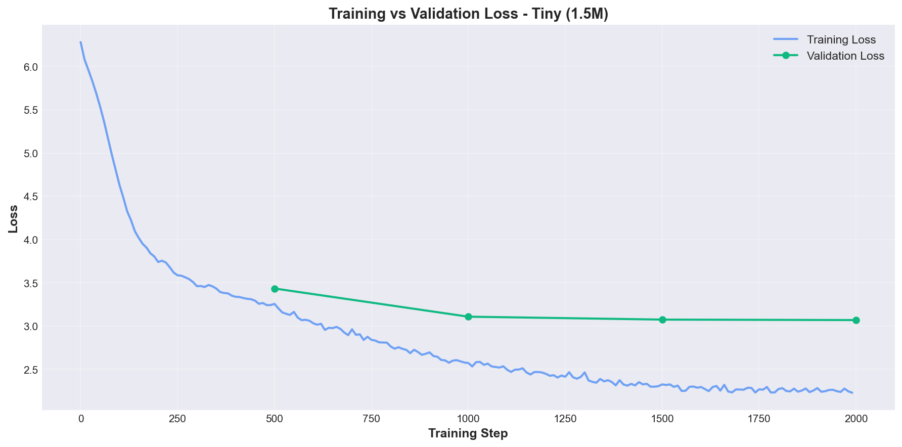
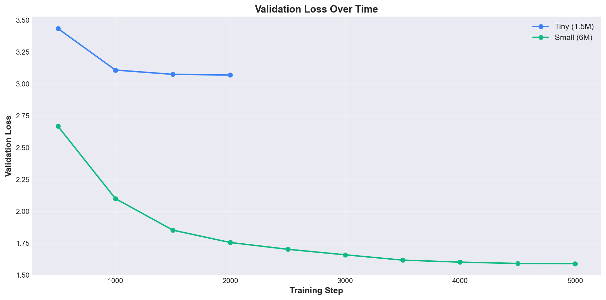
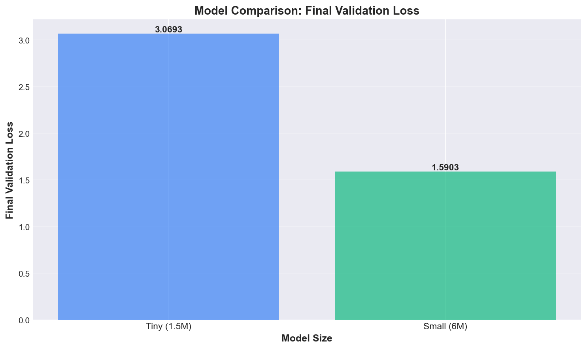

# MiniGPT

<p align="center">
  
  
  
  
  
  
</p>

A minimal GPT-style language model trained from scratch on TinyStories.
The goal is simple: build and understand the full pipeline yourself, from tokenizer training to inference.

## What This Is

I built this project to understand the full training lifecycle of a small language model without relying on high-level training frameworks. The focus was to implement and debug each core layer directly, including byte-level tokenization, autoregressive transformer training, checkpointing, and inference serving. For research-oriented work, this gives a transparent baseline where behavior and bottlenecks are easy to inspect and extend.

## Features

- **Custom byte-level BPE tokenizer** trained on TinyStories text
- **GPT model implementation** with causal self-attention and feed-forward blocks
- **Multi-device training** support for Apple Silicon (MPS), CUDA, and CPU
- **Checkpointed training loop** with eval interval and cosine LR schedule
- **Text generation CLI** with temperature, top-k, and top-p controls
- **FastAPI inference server** for simple REST-based generation

## Running Locally

```bash
# Clone
git clone https://github.com/turancannb02/minigpt
cd minigpt

# Install dependencies
uv sync
```

### First Training Run (build tokenizer + token cache)

```bash
uv run python train.py \
  --force-retokenize \
  --max-train-samples 100000 \
  --max-val-samples 10000 \
  --max-steps 2000 \
  --eval-interval 500
```

### Iteration Runs (reuse cached tokenizer/data)

```bash
uv run python train.py \
  --max-train-samples 100000 \
  --max-val-samples 10000 \
  --max-steps 2000 \
  --eval-interval 500
```

Notes:
- `--force-retokenize` retrains tokenizer and re-tokenizes the full dataset.
- For faster experimentation, run without `--force-retokenize` after the first run.

## Generate Text

```bash
# Single prompt
uv run python generate.py \
  --checkpoint checkpoints/final.pt \
  --prompt "Once upon a time" \
  --max-tokens 120 \
  --temperature 0.8

# Interactive mode
uv run python generate.py \
  --checkpoint checkpoints/final.pt \
  --interactive
```

## Run API Server

```bash
uv run python serve.py --checkpoint checkpoints/final.pt --port 8000
```

| Endpoint | Method | Description |
|---|---|---|
| `/` | GET | API info |
| `/health` | GET | Model/server health |
| `/generate` | POST | Text generation |
| `/docs` | GET | Swagger UI |

Example request:

```bash
curl -X POST "http://localhost:8000/generate" \
  -H "Content-Type: application/json" \
  -d '{
    "prompt": "Once upon a time",
    "max_tokens": 100,
    "temperature": 0.8
  }'
```

## Sample Output

Prompt: `Once upon a time`

```text
Once upon a time there was a little boy named Tom.
He had a red ball and he liked to play in the garden.
One day he saw a small bird and said hello to it.
```

## Training Results

The model was trained on the TinyStories dataset with custom byte-level BPE tokenization. Below are training curves and comparisons between different model sizes.

### Training & Validation Loss

<div align="center">
  
  <p><em>Tiny Model (1.5M parameters) - Training vs Validation Loss over 2000 steps</em></p>
</div>

### Validation Loss Comparison

<div align="center">
  
  <p><em>Validation Loss Over Time - Tiny vs Small Model Comparison</em></p>
</div>

### Model Comparison

<div align="center">
  
  <p><em>Final Validation Loss by Model Size</em></p>
</div>

| Model Size | Parameters | Final Val Loss | Training Time |
|------------|------------|----------------|---------------|
| Tiny | 1.5M | 3.07 | ~78 min (2000 steps) |
| Small | 6M | **1.59** | ~269 min (5000 steps) |

## Training Arguments

| Argument | Default | Description |
|---|---|---|
| `--model-size` | `tiny` | Model config: `tiny`, `small`, `medium` |
| `--vocab-size` | `512` | BPE vocabulary size |
| `--context-length` | `256` | Sequence context length |
| `--batch-size` | `64` | Training batch size |
| `--learning-rate` | `3e-4` | Initial learning rate |
| `--weight-decay` | `0.1` | AdamW weight decay |
| `--max-steps` | `10000` | Number of training steps |
| `--warmup-steps` | `100` | LR warmup steps |
| `--eval-interval` | `500` | Validation/checkpoint interval |
| `--eval-batches` | `50` | Validation batches per eval |
| `--gradient-clip` | `1.0` | Gradient clipping value |
| `--force-retokenize` | `False` | Rebuild tokenizer and token files |
| `--max-train-samples` | `None` | Cap train samples for quick runs |
| `--max-val-samples` | `None` | Cap val samples for quick runs |

## Project Structure

```text
minigpt/
├── data.py              # TinyStories download + BPE tokenizer + token datasets
├── model.py             # GPT architecture and model configs
├── train.py             # Training loop, evaluation, checkpoints
├── generate.py          # CLI text generation
├── serve.py             # FastAPI inference server
├── test_mps.py          # Quick MPS environment check
├── requirements.txt     # pip dependency list
├── pyproject.toml       # project metadata and dependencies
├── uv.lock              # locked dependency graph for uv
├── checkpoints/         # saved model checkpoints (generated)
└── data/                # tokenizer and tokenized arrays (generated)
```

## Roadmap

- [x] Train a GPT model from scratch on TinyStories
- [x] Implement custom BPE tokenizer pipeline
- [x] Add inference CLI with sampling controls
- [x] Add FastAPI generation endpoint
- [ ] Add tests for tokenizer and training utilities
- [ ] Add benchmark script for generation speed and quality snapshots
- [ ] Add optional experiment tracking (CSV or lightweight logger)

## Acknowledgments

- TinyStories dataset: [roneneldan/TinyStories](https://huggingface.co/datasets/roneneldan/TinyStories)
- nanoGPT inspiration: [karpathy/nanoGPT](https://github.com/karpathy/nanoGPT)
